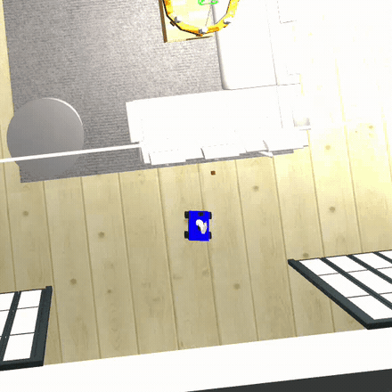
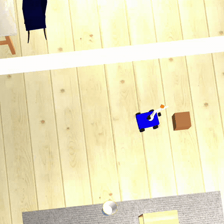

# NL2Plan Agent

Natural-language commands → structured plan → verified low-level control in simulation.

A local LLM (Qwen2.5-7B via Ollama) takes a command like *"pick up the magenta block and put it on the table"*, decomposes it into a sequence of tool calls, and drives a Nav2 navigation stack, a perception node, and an arm controller inside Gazebo. The model reads the result of every call and re-plans when one fails.

The pattern is the SayCan / PaLM-E lineage: the LLM does task-level reasoning, classical / verified components do low-level control. The point is to show LLM portfolio work that has physical grounding, not just prompt engineering.

## What it does today

| Fetching the brown block from behind the sofa | Docking at the drop table to place it |
| :---: | :---: |
|  |  |

*Both clips are from one recorded session, shown at 2× speed. Left: the last stretch of an approach and the grasp. Right: the base creeps until the stall guard reports contact with the table, then the arm releases.*

Four 5 cm blocks sit one per area of a simulated house. Typed commands drive the robot to fetch any of them:

```
$ nl2plan --interactive
robot> pick up the magenta block and place it on table
[completed, 7 steps, 144.0s]
I have successfully placed the magenta block on the table. The task is now complete.
```

Commands in a session share one conversation. Asked afterwards where it found each block, the model answers from that history in a single step (~10 s) with the robot standing still, rather than driving off to look again. Single-shot mode (`nl2plan "…"`) runs one command and exits.

## Architecture

```
[CLI / Streamlit sidebar]
       |
       v
[Agent orchestrator]  <----- tool results, including failures -----+
  step + wall-clock caps                                            |
  JSON schema validation                                            |
  narration + empty-reply nudges                                    |
  JSONL trace of every call                                         |
       |                                                            |
       | tool calls (Ollama tool-use API)                            |
       v                                                            |
[Tool dispatcher]  ->  MockBackend (no ROS2)  or  Ros2Backend  -----+
  navigate_to  --+                                   |
  find_object  --|                                   v
  pick         --|                        [Robot stack]
  place        --+                          Nav2  (NavFn planner + DWB
                                                   controller + AMCL)
                                            color_block_detector
                                              HSV bands per colour,
                                              size-vs-distance gate,
                                              /block_pose/<colour>
                                            arm + gripper (ros2_control)
                                                   |
                                                   v
                                            [Gazebo] mobile_arm_sim
                                            mecanum base + 4-DOF arm
```

Each tool verifies its own work rather than assuming success:

- **`find_object`** stops the base, spins in place, and accepts nothing until four consecutive sightings cluster within 0.2 m **in the robot's frame**. Localization error lands in both the robot pose and the detector's back-projection, so measuring relative to the robot cancels it — without that, a stationary block scatters past the gate whenever the heading estimate drifts.
- **`pick`** hands the approach to Nav2 (a blind creep once drove into a stool), re-confirms the block dead ahead at a 0.6 m standoff, and drives only the last stretch on odometry. If the block cannot be re-confirmed, or the creep presses into something before reaching grasp range, **the pick is refused** and the model is told to scan again. The grasp is a pinned attachment, which would "succeed" from anywhere, so honesty has to be enforced before it rather than by it.
- **`place`** docks by touch — creep until the stall guard reports contact with the table — because a pose-based stop missed the 0.30 m table about half the time.

[docs/architecture.md](docs/architecture.md) goes further: what each module's contract is, what replacing it would cost, the sixteen safety invariants the code enforces, and an honest account of the coupling that a modularity claim has to answer for.

## Repo layout

```
NL2Plan agent/
  src/
    nl2plan_agent/       agent loop, tool dispatcher, prompt, Streamlit sidebar
      ros_backend/       live ROS2 tools: nav, perception, manipulation, node
    perception_node/     multi-colour block detector + scene setup
  config/named_poses.yaml   home, gym, bedroom, sofa, lounge, table
  tests/                    36 tests, no ROS2 required
  docs/known_issues.md      findings from an independent review, with fixes planned
  DEMO_CHECKLIST.md         recording protocol
  scripts/setup_linux.sh
```

The robot itself lives in a sibling workspace: `/home/reddy/ros2_ws/src/mobile_arm_sim/` (professor-led research project). NL2Plan depends on `mobile_arm_sim` being launched and its topics/actions live.

## Quickstart

The agent and its tests are pure Python; only the live backend needs ROS2.

### Dry run against the mock world (no ROS2)

```bash
pip install -r requirements.txt
ollama pull qwen2.5:7b-instruct
python3 -m nl2plan_agent.agent --mock "pick up the magenta block and put it on the table"
```

The mock backend mirrors the live one's world and error strings, so the LLM behaviour you see is the behaviour you get on the robot.

### Full sim (Linux + ROS2 Humble + Ollama + mobile_arm_sim)

```bash
bash scripts/setup_linux.sh                                   # ROS2 deps + Python deps + colcon build
source install/setup.bash
source /home/reddy/ros2_ws/install/setup.bash                 # mobile_arm_sim
ros2 launch perception_node nl2plan_sim.launch.py             # Gazebo + Nav2 + the multi-colour detector
ros2 lifecycle get /bt_navigator                              # wait for: active [3]
nl2plan --interactive
streamlit run src/nl2plan_agent/nl2plan_agent/sidebar_app.py  # optional, second terminal
```

Blocks stay wherever a mission leaves them. `ros2 run perception_node scene_setup` teleports all four back to their home positions; see [DEMO_CHECKLIST.md](DEMO_CHECKLIST.md).

Tests: `pytest -p no:launch_testing -p no:launch_ros` (the plugin flags avoid a collection clash when ROS2 is sourced).

## Results

Measured 2026-07-21, real-time factor ~1.0. Protocol: fresh sim, scene reset to home positions before each mission, one mission per agent invocation.

| Block (search pose) | Runs | Completed | Model steps | Mission time |
| --- | --- | --- | --- | --- |
| red (bedroom) | 2 | 2 | 4, 4 | 141 s, 142 s |
| magenta (gym) | 2 | 2 | 7, 7 | 144 s, 154 s |
| brown (behind the sofa) | 2 | 2 | 7, 7 | 133 s, 142 s |
| orange (lounge) | 2 | 2 | 7, 8 | 132 s, 140 s |

No failed tool calls anywhere in that batch. Separately, one continuous interactive session fetched all four blocks back to back at six model steps each.

Mission time is wall clock from command to final answer and includes model inference; the robot is driving for most of it.

Recovery paths exercised on earlier builds the same day: an empty scan sends the robot to another room and back, a refused grasp triggers a re-scan and then a successful pick, and a reply that narrates instead of acting is nudged back on task mid-mission.

Still to come: the Stage 3 protocol below (three commands × ten runs) with recovery rate and replan latency broken out.

## Stages

| Stage | What | Status |
| --- | --- | --- |
| 0 | Linux env + Ollama + agent smoke test | done |
| 1 | mobile_arm_sim infrastructure (sensors, scene, map, Nav2, perception) | done |
| 2 | Tool layer — `Ros2Backend` wired to Nav2, perception, arm | done; all four tools verified live |
| 3 | LLM agent + recovery loop on the real sim | working end to end; formal 10-run metrics pending |
| 4 | Polish + demo video + README metrics | video recorded; metrics table above is partial |

## Design trade-offs

These are honest and meant to be visible in the README, not hidden.

- **Consolidated with the professor's `mobile_arm_sim`.** The robot, sim, sensors, and Nav2 stack are shared with a professor-led research project. Two deliverables ship from one infrastructure: a Python state-machine version (the research checkpoint) and this LLM-driven version. An earlier iteration committed to a custom Ackermann chassis + Hybrid A*, and switched once the robot's holonomic kinematics and Nav2 plan came into view.
- **A small local model, on purpose.** How reliable a 7B model can be made under tool use is part of the question, so there is no hosted-LLM fallback. Its real failure modes here are calling `pick` with a placeholder identifier, narrating an action instead of calling the tool, and returning an empty message mid-mission. Each has a specific guard, and the most effective fix was rewriting tool *errors* — an error that names the identifier that would have worked gets a correction on the next call, where one that only says "run find_object first" gets an infinite re-scan.
- **The prompt carries a semantic map.** The system prompt names the area each block lives in. Without it the model searched rooms at random and hit the step cap before reaching a pick. It only chooses which room to drive to first; perception still does the real work on arrival. Randomised spawns with a pure sweep search are the planned honest robustness test.
- **The grasp is simulated.** Blocks are pinned to the gripper link through Gazebo's entity-state service rather than gripped by friction. Contact-based grasping is future work; the interesting problems here were search, approach, and verification.
- **Framing.** SayCan / PaLM-E lineage (LLM task planning over verified controllers). Not Tesla Optimus, which is moving toward end-to-end neural policies.

## Known issues

Kept in the open at [docs/known_issues.md](docs/known_issues.md), from an independent review of the approach and perception code. The most significant is that `align()`'s final heading trim still computes its bearing in the map frame, so a localization correction arriving mid-creep can rotate the robot away from the block.

## Acknowledgements

Builds on:
- [Nav2](https://navigation.ros.org/)
- [Ollama](https://ollama.com/)
- The `mobile_arm_sim` robot from ongoing professor-led research (private)

Future enhancements:
- [GroundingDINO](https://github.com/IDEA-Research/GroundingDINO) — open-vocabulary `find_object`, so distractors need not differ by colour
- [MoveIt2](https://moveit.ai/) — planned upgrade for `pick` / `place`
- [Hybrid A* path planner](https://github.com/redddddyyyyy/hybrid-astar-planner) (parked)

## License

MIT.
